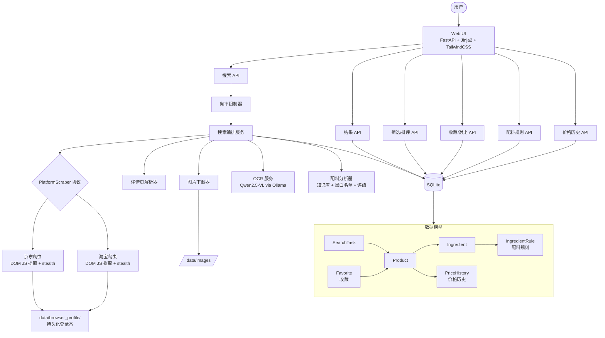

# Shopping Assist

跨电商平台商品配料表智能查询与比价工具。

## 功能

- **多平台搜索**: 京东 + 淘宝商品搜索（DOM JS 提取 + stealth 反检测）
- **配料表 OCR**: 通过本地多模态 LLM (Qwen2.5-VL) 识别配料表图片
- **配料智能分析**: 内置 30+ 常见添加剂知识库，自动安全评级（安全/警告/避免）
- **黑白名单**: 自定义配料黑名单/白名单，搜索结果自动标记
- **配料评分**: 白名单命中数 - 黑名单命中数，量化配料质量
- **排序筛选**: 按价格/配料评分排序，按配料关键词筛选，排除黑名单
- **收藏对比**: 收藏商品后跨平台并排对比价格和配料
- **价格追踪**: 自动记录历史价格，查看价格变化趋势
- **智能推荐**: 首页展示配料评分最高的商品

## 技术栈

- **后端**: Python 3.11+ / FastAPI
- **前端**: Jinja2 + TailwindCSS (SSR)
- **数据库**: SQLite + SQLAlchemy 2.0
- **爬虫**: Playwright + playwright-stealth（DOM JS 提取，非 HTML 解析）
- **OCR**: Qwen2.5-VL via Ollama

## 快速开始

```bash
# 1. 创建虚拟环境并安装依赖
python3 -m venv .venv
source .venv/bin/activate
pip install -e ".[dev]"

# 2. 安装 Playwright 浏览器
playwright install chromium

# 3. 安装 OCR 模型（需先安装 Ollama）
ollama pull qwen2.5-vl:7b

# 4. 首次使用：登录电商平台（保存浏览器登录态）
python scripts/browser_login.py all

# 5. 启动应用
uvicorn src.app:app --reload --port 8000
```

访问 http://localhost:8000 开始使用。

### 平台登录说明

淘宝和京东搜索需要登录态。首次使用前需通过持久化浏览器完成登录：

```bash
python scripts/browser_login.py tb   # 只登录淘宝
python scripts/browser_login.py jd   # 只登录京东
python scripts/browser_login.py all  # 两个平台都登录
```

浏览器弹出后手动扫码/输密码完成登录，登录态保存在 `data/browser_profile/`，后续无需重复登录。

### Docker 部署

```bash
docker compose up -d
```

SQLite 数据库和图片通过 volume 挂载持久化到 `/app/data`。

## 系统架构



### 搜索链路

```
用户输入关键词 → 频率限制 → 平台爬虫 (DOM JS 提取商品列表)
  → 详情页解析 (文字配料 / 图片 URL)
  → OCR 识别 (图片配料表 → Qwen2.5-VL)
  → 配料分析 (知识库匹配 + 黑白名单标记 + 评分)
  → 入库 (商品 + 配料 + 价格历史)
  → 展示结果 (排序/筛选/收藏/对比)
```

## 项目结构

```
src/
├── app.py                  # FastAPI 应用入口与路由
├── config.py               # 环境变量配置 (SA_ 前缀)
├── database.py             # 数据库连接
├── models.py               # 数据模型 (SearchTask, Product, Ingredient, etc.)
├── scraper/
│   ├── platform.py         # PlatformScraper 协议与注册表
│   ├── jd.py               # 京东爬虫 (DOM JS 提取)
│   ├── parser.py           # 京东详情页 HTML 解析
│   ├── tb.py               # 淘宝爬虫 (DOM JS 提取)
│   └── tb_parser.py        # 淘宝详情页 HTML 解析
├── ocr/
│   ├── service.py          # Ollama OCR 服务
│   └── ingredient_parser.py # 配料文本解析
├── services/
│   ├── search.py           # 搜索编排服务
│   ├── rate_limiter.py     # 频率限制器
│   └── ingredient_knowledge.py  # 配料安全知识库
└── templates/              # Jinja2 模板
scripts/
├── browser_login.py        # 持久化浏览器登录助手
└── verify_search.py        # 搜索功能验证脚本
```

## 测试

```bash
# 运行全量测试
.venv/bin/python -m pytest tests/ -v

# 当前: 59 tests, all passing
```

## 配置

通过环境变量配置（前缀 `SA_`）：

| 变量 | 默认值 | 说明 |
|------|--------|------|
| SA_MAX_DAILY_SEARCHES | 1 | 每日最大搜索次数 |
| SA_MAX_PRODUCTS_PER_SEARCH | 30 | 每次搜索最大商品数 |
| SA_OLLAMA_MODEL | qwen2.5-vl:7b | OCR 模型 |
| SA_OLLAMA_BASE_URL | http://localhost:11434 | Ollama 地址 |
| SA_SCRAPER_HEADLESS | true | 无头浏览器模式 |
| SA_DB_URL | sqlite:///data/shopping.db | 数据库连接 |
| SA_DATA_DIR | data | 数据目录 |

## License

MIT
