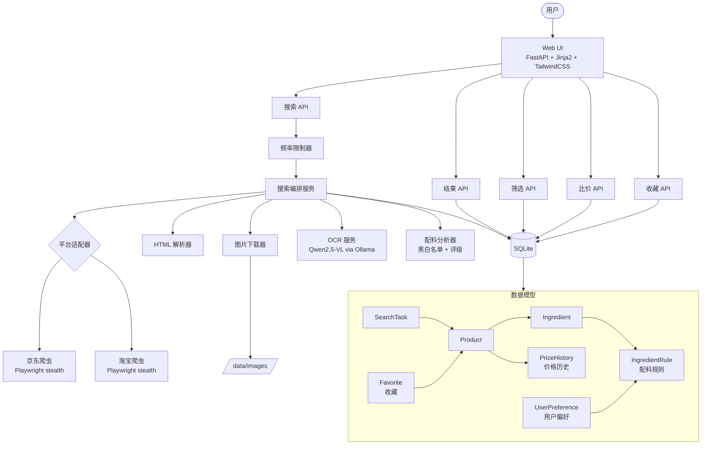
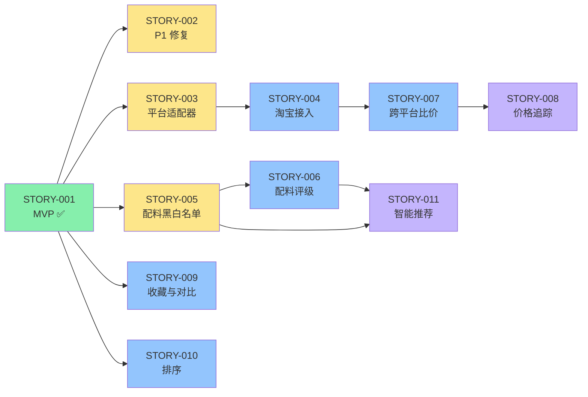

# Product Requirements Document: Shopping Assist
- **Version**: 1.0
- **Date**: 2026-04-16

---

## 1. Product Overview

### 1.1 Vision
> 通过跨电商平台的商品配料表智能识别与对比，让用户轻松找到配料干净、性价比高的食品。

### 1.2 Problem Statement
食品购物者在京东、淘宝等平台选购食品时，需要逐个点开商品详情页查看配料表。配料表大多以图片形式存在，无法搜索和对比。整个过程极其繁琐耗时——查看 30 个商品的配料表可能需要 1-2 小时。用户无法快速筛选出"NFC果汁"、"零添加酱油"等符合自己标准的产品。

### 1.3 Target Users
- **Primary**: 关注食品配料质量的个人消费者（对"干净配料"有明确诉求）
- **Secondary**: 追求性价比的食品选购者（希望跨平台比价）

---

## 2. User Personas

### Persona 1: 小冰 — 健康饮食追求者
- **Role**: 上班族，日常采购家庭食品
- **Goals**: 快速找到配料干净、无不良添加剂的食品
- **Pain Points**: 
  - 每次选购都要花大量时间翻看配料表图片
  - 无法跨平台对比同类商品的配料和价格
  - 不确定哪些添加剂是安全的
- **Jobs-to-be-Done**:
  - *Functional*: 搜索商品关键词 → 看到所有商品的配料列表 → 过滤出符合标准的 → 选择最优
  - *Emotional*: 对食品选择感到放心和掌控
  - *Social*: 被家人认可为会挑选优质食品的人

### Persona 2: 价格敏感型买家
- **Role**: 学生或预算有限的消费者
- **Goals**: 在配料可接受的前提下找到最便宜的选择
- **Pain Points**:
  - 同一商品在京东和淘宝价格不同，手动对比麻烦
  - 找不到一个能同时看配料和价格的工具
- **Jobs-to-be-Done**:
  - *Functional*: 输入商品名 → 同时看到多个平台的价格和配料 → 选择最划算的
  - *Emotional*: 花最少的钱买到最好的东西，感到满足
  - *Social*: 被朋友认为是"会买东西"的人

---

## 3. Feature Breakdown

### Epic 1: 基础优化（修复 MVP 已知问题）

| Story | Description | Impact (1-5) | Effort (1-5) | Priority (I/E) | Horizon |
|-------|-------------|:------------:|:------------:|:--------------:|---------|
| STORY-002 | 修复 URL 编码 + N+1 查询 + 路径穿越 | 4 | 1 | 4.0 | Now |

### Epic 2: 多平台支持

| Story | Description | Impact (1-5) | Effort (1-5) | Priority (I/E) | Horizon |
|-------|-------------|:------------:|:------------:|:--------------:|---------|
| STORY-003 | 平台适配器抽象层 — 统一爬虫接口 | 4 | 2 | 2.0 | Now |
| STORY-004 | 淘宝/天猫平台接入 | 5 | 4 | 1.25 | Next |

### Epic 3: 配料智能分析

| Story | Description | Impact (1-5) | Effort (1-5) | Priority (I/E) | Horizon |
|-------|-------------|:------------:|:------------:|:--------------:|---------|
| STORY-005 | 配料黑名单/白名单管理 | 5 | 2 | 2.5 | Now |
| STORY-006 | 配料安全评级（自动标记常见添加剂风险等级） | 4 | 3 | 1.33 | Next |

### Epic 4: 价格与比价

| Story | Description | Impact (1-5) | Effort (1-5) | Priority (I/E) | Horizon |
|-------|-------------|:------------:|:------------:|:--------------:|---------|
| STORY-007 | 跨平台商品比价视图 | 4 | 3 | 1.33 | Next |
| STORY-008 | 历史价格追踪与趋势图 | 3 | 3 | 1.0 | Later |

### Epic 5: 用户体验增强

| Story | Description | Impact (1-5) | Effort (1-5) | Priority (I/E) | Horizon |
|-------|-------------|:------------:|:------------:|:--------------:|---------|
| STORY-009 | 商品收藏与对比清单 | 3 | 2 | 1.5 | Next |
| STORY-010 | 搜索结果排序（按价格/配料评分/综合） | 3 | 2 | 1.5 | Next |

### Epic 6: 智能推荐

| Story | Description | Impact (1-5) | Effort (1-5) | Priority (I/E) | Horizon |
|-------|-------------|:------------:|:------------:|:--------------:|---------|
| STORY-011 | 基于配料偏好的商品推荐 | 3 | 4 | 0.75 | Later |

---

## 4. Architecture Design

### Tech Stack (已确定)
- **Frontend**: Jinja2 + TailwindCSS (SSR)
- **Backend**: Python 3.11+ / FastAPI
- **Database**: SQLite + SQLAlchemy 2.0
- **Scraping**: Playwright (stealth)
- **OCR**: Qwen2.5-VL via Ollama

---

## 5. Page/Screen Design

### Page: 搜索首页 (已实现)
- **Purpose**: 输入搜索关键词，发起商品搜索
- **Components**: 搜索框 → 搜索按钮 → 频率提示 → 历史搜索列表

### Page: 搜索结果页 (已实现，需增强)
- **Purpose**: 展示商品列表、配料信息、筛选功能
- **增强**: 添加排序选项、配料评级标记、收藏按钮

### Page: 商品对比页 (新增)
- **Purpose**: 并排对比收藏的商品，突出配料和价格差异
- **Components**: 对比卡片网格 → 配料差异高亮 → 价格对比条

### Page: 配料管理页 (新增)
- **Purpose**: 管理配料黑名单/白名单和安全评级
- **Components**: 配料列表 → 分类标签（安全/警告/危险）→ 添加/删除操作

### Page: 价格趋势页 (新增)
- **Purpose**: 查看商品历史价格变化
- **Components**: 折线图 → 时间范围选择 → 平台切换

---

## 6. API Design

### Endpoints (在现有基础上扩展)

| Method | Path | Description | Horizon |
|--------|------|-------------|---------|
| GET | `/` | 搜索首页 | 已实现 |
| POST | `/search` | 创建搜索任务 | 已实现 |
| GET | `/results/{id}` | 查看搜索结果 | 已实现 |
| GET | `/results/{id}/filter` | 筛选结果 | 已实现 |
| GET | `/results/{id}/sort` | 排序结果 | Now |
| POST | `/favorites/{product_id}` | 收藏商品 | Next |
| DELETE | `/favorites/{product_id}` | 取消收藏 | Next |
| GET | `/favorites` | 收藏列表 | Next |
| GET | `/compare` | 商品对比页 | Next |
| GET | `/ingredients/rules` | 配料规则列表 | Now |
| POST | `/ingredients/rules` | 添加配料规则 | Now |
| DELETE | `/ingredients/rules/{id}` | 删除配料规则 | Now |
| GET | `/price-history/{product_id}` | 价格历史 | Later |

### New Data Models

- **IngredientRule**: `id, name, category(blacklist/whitelist/warning), description, created_at`
- **PriceHistory**: `id, product_id, price, platform, recorded_at`
- **Favorite**: `id, product_id, note, created_at`

### Auth Strategy
无认证（个人工具）。

---

## 7. Non-Functional Requirements

- **Performance**: 搜索结果页加载 < 500ms（数据库查询）；爬取任务 < 5min/30商品
- **Security**: 输入验证（XSS/注入防护）；无用户认证但需防止爬虫滥用
- **Scalability**: 个人使用，单用户模式；SQLite 足够

---

## 8. Success Metrics

| Epic | Metric | Target | How to Measure |
|------|--------|--------|----------------|
| 基础优化 | 已知 P1 问题数 | 0 | Check 报告 |
| 多平台支持 | 支持的平台数 | 2 (京东+淘宝) | 功能测试 |
| 配料智能分析 | 配料识别覆盖率 | > 90% 商品有配料数据 | DB 统计 |
| 价格与比价 | 有价格数据的商品占比 | 100% | DB 统计 |
| 用户体验增强 | 单次选购决策时间 | < 10 分钟（原 1-2 小时） | 用户体感 |

---

## 9. MVP Roadmap

### Now (Sprint 1-3): 核心强化
> STORY-001 已完成。现在修复已知问题并增强核心功能。
- [x] STORY-001: MVP 核心闭环 — 京东搜索与配料表提取 ✅
- [ ] STORY-002: 修复 P1 — URL 编码 + N+1 查询 + 路径安全
- [ ] STORY-003: 平台适配器抽象层 — 统一爬虫接口
- [ ] STORY-005: 配料黑名单/白名单管理

### Next (Sprint 4-8): 差异化
> 跨平台比价和智能配料分析是核心竞争力。
- [ ] STORY-004: 淘宝/天猫平台接入
- [ ] STORY-006: 配料安全评级
- [ ] STORY-007: 跨平台商品比价视图
- [ ] STORY-009: 商品收藏与对比清单
- [ ] STORY-010: 搜索结果排序

### Later (Sprint 9+): 扩展
> 高级功能，依赖数据积累。
- [ ] STORY-008: 历史价格追踪与趋势图
- [ ] STORY-011: 基于配料偏好的商品推荐

---

## 10. Story Dependency Graph

